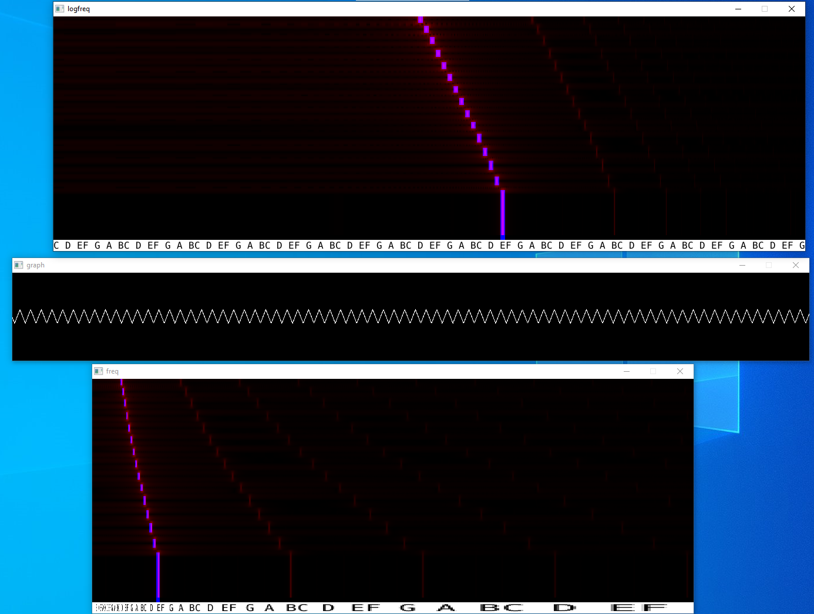

Piano program with FFT waterfall plot, wave graph, piano roll

To compile on debian based linux:

`sudo apt-get install build-essential libfftw3-dev libsdl2-dev zlib1g-dev`

`make -k`

To compile on windows read the instructions in the Makefile and then
run the command `make -k` at the location the Makefile is.
If the `make -k` command does not compile the program, try `mingw32-make -k` 

